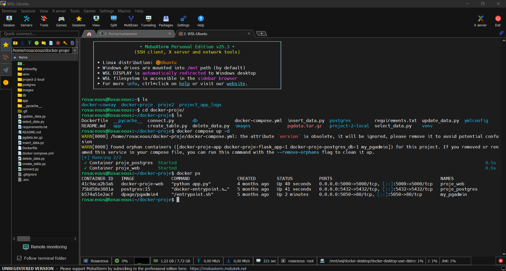
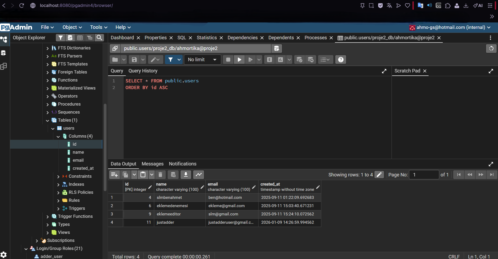
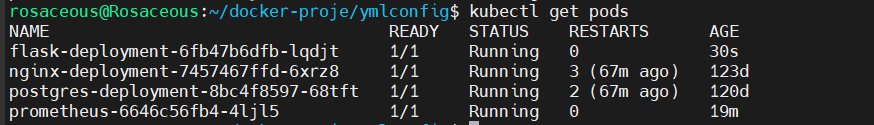
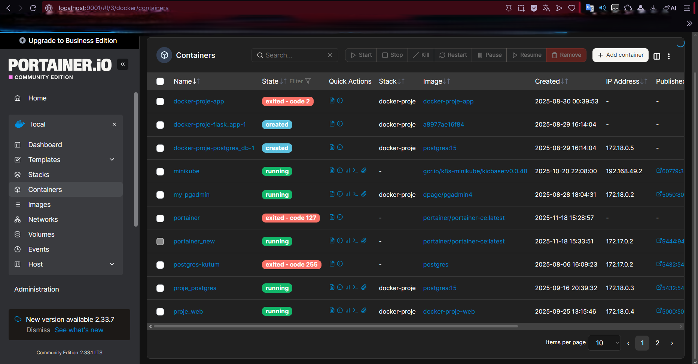

# DevOps Infrastructure Lab

This repository contains a hands-on DevOps and system infrastructure lab project designed to demonstrate practical skills in Linux, Docker, Kubernetes, and monitoring.

## 🧱 Project Overview

The goal of this project is to simulate a real-world DevOps infrastructure by deploying a web application with a database, reverse proxy, and monitoring stack using container technologies.

## 🛠 Technologies Used

- Linux
- Docker & Docker Compose
- Kubernetes
- Nginx
- PostgreSQL
- Flask
- Prometheus
- Bash scripting

## 🗂 Project Structure
```
.
├── docker/
│ ├── docker-compose.yml
│ └── postgres/
├── kubernetes/
│ ├── flask-deployment.yaml
│ ├── postgres-deployment.yaml
│ ├── nginx-deployment.yaml
│ └── services/
├── monitoring/
│ └── prometheus.yml
├── scripts/
│ └── log-monitor.sh
├── .gitignore
└── README.md
```
## 🚀 What This Project Demonstrates

- Containerized application deployment with Docker
- Service orchestration using Docker Compose
- Kubernetes deployments and services
- Reverse proxy configuration with Nginx
- Monitoring setup using Prometheus
- Basic Linux system automation with Bash scripts
- Understanding of DevOps workflows and infrastructure concepts

## 📌 Notes

This project was created as a self-learning and portfolio project to gain hands-on experience in DevOps and Cloud-oriented system engineering.

## 📫 Contact

GitHub: https://github.com/ahmortika

## 📸 Project Screenshots

The following screenshots were taken during the real execution of the project.
They demonstrate that the infrastructure components are properly deployed, running, and managed.

### 🐳 Docker Compose – Running Services
Docker Compose successfully running all defined services such as Flask, PostgreSQL, and Nginx.


### ☸️ Kubernetes – Active Pods
Kubernetes workloads running on Minikube, showing healthy Flask, PostgreSQL, and Nginx pods.


### 🗄️ PostgreSQL – pgAdmin Dashboard
pgAdmin interface connected to the PostgreSQL database running inside the infrastructure.


### 📊 Prometheus – Monitoring UI
Prometheus web interface displaying active targets and metrics collection.


### 🔐 Kubernetes RBAC – Role-Based Access Control
Role-Based Access Control (RBAC) configuration demonstrating permission separation.


### 🧭 Portainer – Container Management Dashboard
Portainer dashboard used for container and service management.

